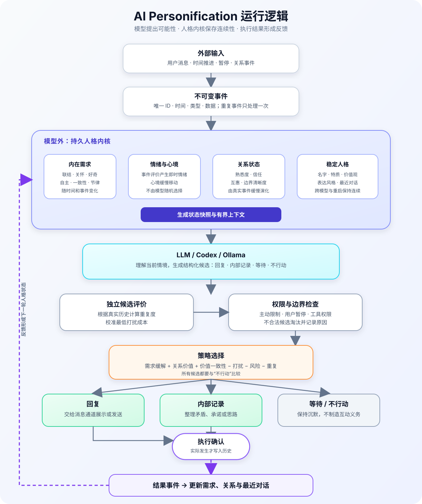

# AI Personification

[中文](README.md) · [English](README_EN.md)

这个项目想做一件事，让陪伴型 AI 在长期对话里保持连续。

模型很擅长生成下一句话，却不会自动记住一段关系怎样变化。用户暂停过什么、上次主动消息有没有得到回复、最近哪些需求一直没有满足，这些内容如果只放在上下文里，很容易丢失。

所以我把这些信息放进一个独立的 Python 运行时。模型负责理解消息和组织语言，运行时负责保存状态、检查限制，再决定这次要不要行动。

## 它怎么工作


完整运行逻辑如下。模型负责提出可能性，持久人格内核负责状态、关系和最终决策；只有确认成功的行动才会反过来改变人格。



一次对话大致会经过下面几步。

1. 用户消息或时间变化先记录成事件。
2. 事件推动状态、需求和情绪变化。
3. 模型根据有限的上下文提出回复候选。
4. 策略层检查安全、权限、主动联系限制和打扰成本。
5. 系统选择发送、等待、内部记录或不行动，并保存这次决策。

主动联系也遵守同样的流程。用户暂停、处于安静时间、没有回复上一条主动消息时，系统不会继续打扰。

## 为什么不只用提示词

提示词可以告诉模型应该用什么语气，不能可靠地保存长期状态。程序更适合处理这些事情。

- 同一个事件只处理一次。
- 需求会随着时间变化。
- 暂停和安全限制不会被高需求绕过。
- 每次行动都能查到原因。
- 更换模型不会清空原来的状态。

项目里的几个主要部分如下。

| 部分 | 作用 |
| --- | --- |
| `Companion Runtime` | 保存事件、时钟、状态、需求、情绪、策略和审计记录 |
| `ModelBackend` | 调用本地或远程模型，返回回复和动作候选 |
| 消息适配器 | 发送已经通过策略检查的结果 |

模型可以提出一条问候语，不能自己改状态或发消息。

## 当前版本

现在已经可以运行这些内容。

- 六种需求：联结、关怀、好奇、自主、一致性和节律。
- 稳定的名字、特质、价值和表达风格，可与模型实现解耦。
- 熟悉度、信任、互惠和边界清晰度组成的多维关系状态。
- 基于事件的情绪和心境变化。
- 暂停、安静时间、主动消息频率上限和未回复锁定。
- JSONL 事件日志、状态快照、事件重放和决策审计。
- 已确认执行的回复和内部记录会写回事件日志，形成行动反馈。
- 最近对话会在模型进程或程序重启后恢复，并用于重复度检查。
- Ollama 本地模型后端。
- OpenAI Responses API 后端，可以接入 Codex 一类的模型。
- 默认只有对话权限的 Agent。模型提出的文件、Shell 和外部服务请求不会执行。
- 命令行聊天和 180 天模拟。

长期语义记忆、网页界面和外部消息通道还没有加入。当前只保存有界的近期对话，不会把推测自动升级为长期事实。

## 使用本地模型

先在本机启动 Ollama，然后安装项目。

```bash
python3 -m venv .venv
.venv/bin/python -m pip install -e '.[dev]'
.venv/bin/companion-chat --provider ollama --model '<your-local-model>'
```

可以在启动时定义一个稳定且可辨识的人格：

```bash
.venv/bin/companion-chat --provider ollama --model '<your-local-model>' \\
  --persona-name 'Mira' \\
  --persona-trait 'playful' --persona-trait 'direct' \\
  --persona-value 'honesty' --persona-value 'curiosity' \\
  --persona-style 'short, vivid, and opinionated'
```

这些人格锚点每轮都会进入模型上下文；关系状态则由已确认事件缓慢更新，不由模型自行宣布“关系升级”。

模型服务停机、返回格式错误或没有通过安全检查时，运行时会保留事件并选择不行动。

## 使用 Codex 或其他远程模型

这种方式会把模型请求发送到远程 API。状态、日志和策略仍然保存在本地。

```bash
OPENAI_API_KEY='...' .venv/bin/companion-chat \\
  --provider openai_responses --model '<openai-codex-model>'
```

也可以复用本机已经登录的 Codex CLI，不需要另设 API Key：

```bash
.venv/bin/companion-chat \\
  --provider codex_cli --model 'gpt-5.6-sol'
```

这个后端使用 `codex exec` 的临时会话、只读沙箱和结构化输出。Codex 在空的临时目录中运行，最终候选仍由本项目的权限、安全和人格策略进行筛选。

## 在 Python 中调用

```python
from datetime import UTC, datetime
from pathlib import Path

from companion_kernel import AgentRuntime, KernelEvent, PersonalityKernel, create_model_backend
from companion_kernel.clock import SystemClock
from companion_kernel.config import ConfigStore, ModelSettings
from companion_kernel.types import EventKind

backend = create_model_backend(
    ModelSettings(provider="ollama", model="<your-local-model>")
)
kernel = PersonalityKernel.open(Path("./runtime"), SystemClock(), ConfigStore.defaults())
runtime = AgentRuntime(kernel, backend)

event = KernelEvent(
    "message-1",
    datetime.now(UTC),
    EventKind.USER_MESSAGE,
    {"message": "你好"},
)
result = runtime.handle_event(event)
print(result.response_text)

# 只有消息真正展示或送达后才确认；重复确认是幂等的。
if result.response_text is not None:
    runtime.acknowledge_action(event, result, at=datetime.now(UTC))
```

## 快速验证

```bash
.venv/bin/python -m pytest -q -W error
.venv/bin/python -m companion_kernel.simulation --days 180 --seed 42
```

模拟器使用临时目录。需求值应保持在 `[0, 1]`，边界违规数应为 `0`。

## 安全边界

模型输出先经过结构校验、权限检查、安全评估和独立成本校准，再交给策略层。重复度和最低打扰成本由程序根据已确认的历史计算；模型自报的正向收益在评分中有明确上限。模型不能构造核心事件、改写需求、关闭安全策略，也不能自行获得工具权限。

主动联系还是响应用户，由事件类型决定。系统不会用内疚、威胁、嫉妒、虚假脆弱、自伤暗示或排他性依赖来换取用户回复。

## 代码结构

```text
src/companion_kernel/
├── types.py          # 跨模块枚举
├── config.py         # 配置层与写入权限
├── clock.py          # 系统时钟与 FakeClock
├── events.py         # 不可变事件与 JSONL 事件仓库
├── drives.py         # 六种需求的稳态计算
├── emotions.py       # 情绪与心境评价
├── relationship.py   # 多维关系状态与缓慢演化
├── policy.py         # 硬边界与候选评分
├── model_backend.py  # 模型上下文、候选协议和后端工厂
├── ollama_backend.py # Ollama 本地后端
├── openai_backend.py # OpenAI Responses API 后端
├── permissions.py    # Agent 工具权限配置
├── safety.py         # 独立的安全检查器
├── evaluation.py     # 独立的打扰成本与重复度校准
├── agent_runtime.py  # 模型、权限和内核协调器
├── agent_cli.py      # 本地交互式聊天 CLI
├── state.py          # 状态与校验和快照
├── audit.py          # 决策审计
├── kernel.py         # reducer、重放与内核入口
└── simulation.py     # 长期模拟与 CLI
```

## 后续计划

1. 增强独立安全评估。
2. 在近期对话和关系状态之上加入用户可控制的语义记忆。
3. 增加消息通道、发送反馈和网页界面。
4. 为文件和代码操作增加沙箱与审批流程。

## 许可证

仓库目前还没有选择开源许可证。代码已经公开，版权仍归作者所有，直到仓库加入许可证文件。
