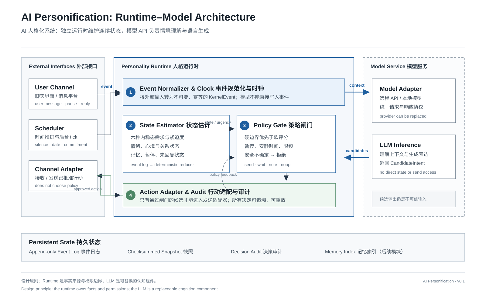

# AI Personification

[中文](README.md) · [English](README_EN.md)

An experimental project for building a long-term AI companion with a persistent personality.

Instead of putting the whole personality into a prompt, the project uses an independent runtime
to maintain state, model drives, evaluate affect, enforce boundaries, and audit decisions. A
language model is used for contextual understanding and expression.

## What this project is

The goal is not a chatbot that starts from zero in every conversation. The goal is a system that
can remain coherent over time:

- it tracks changes in a relationship instead of only replaying isolated messages;
- it has internal drives such as connection, care, curiosity, autonomy, coherence, and rhythm;
- drives accumulate, recover, and conflict, influencing whether action is appropriate;
- it can express emotion without using emotion to manipulate the user;
- it can initiate contact while respecting pauses, quiet hours, refusals, and unanswered messages;
- its core state and behavioral boundaries remain stable when the model provider changes.

## Why use an independent runtime

Prompts are useful for describing style, but they are a poor place to enforce a long-lived state
machine. A prompt alone cannot reliably guarantee that:

- time changes state in a predictable way;
- duplicate events do not apply their effects twice;
- high drive values cannot bypass safety boundaries;
- changing models does not completely change the personality;
- every proactive action can be explained and audited.

The project therefore separates responsibilities:

| Component | Responsibility |
| --- | --- |
| `Companion Runtime` | Events, time, drives, affect, state, policy, safety, audit, and replay |
| `ModelAdapter` | Calls a remote model API or local model, understands context, and proposes candidate intents |
| Channel adapter | Receives user messages and sends only policy-approved actions |

The model may propose “send a check-in,” but it cannot directly change state or send a message.

## How it works



A user message or background time event follows this path:

1. The input becomes an immutable, deduplicated event.
2. The runtime advances virtual time and updates drives and affect.
3. The system builds the required context and asks the model for structured candidates.
4. The policy layer checks hard boundaries first, then compares relief, relationship health, risk, and intrusion cost.
5. The runtime chooses send, internal note, wait, or reject, and writes the result to the event and audit logs.

Background proactive contact follows the same path. When no meaningful drive is active, the runtime
can do nothing. After one proactive message goes unanswered, proactive contact is locked until the
user responds again.

## Implemented in v0.1

- UTC virtual clock and idempotent event log;
- six bounded drives and continuous deficit tracking;
- deterministic emotion appraisal and slow mood updates;
- system, user, and learned-persona configuration authority;
- pause, quiet hours, a one-message-per-24-hours limit, and unanswered-message lock;
- fail-closed behavior when safety assessment is missing or uncertain;
- checksummed snapshots, event replay, and structured decision audit;
- 30/180-day simulations and a 100-seed invariant sweep.

This version does not connect to a specific LLM, implement semantic memory, provide a user interface,
or deliver real messages. Those capabilities are intended to arrive through separate adapters.

## Quick start

Python 3.12 or newer is required.

```bash
python3 -m venv .venv
.venv/bin/python -m pip install -e '.[dev]'
.venv/bin/python -m pytest -q -W error
```

Run a 180-day simulation:

```bash
.venv/bin/python -m companion_kernel.simulation --days 180 --seed 42
```

The simulator uses a temporary runtime directory by default, so runs are isolated and repeatable.
Drive values should remain in `[0, 1]` and boundary violations should remain `0`.

## Repository layout

```text
src/companion_kernel/
├── types.py       # Shared enums
├── config.py      # Configuration layers and write authority
├── clock.py       # System clock and FakeClock
├── events.py      # Immutable events and JSONL event store
├── drives.py      # Six-drive homeostasis engine
├── emotions.py    # Emotion and mood appraisal
├── policy.py      # Hard boundaries and candidate scoring
├── state.py       # Canonical state and checksummed snapshots
├── audit.py       # Structured decision audit
├── kernel.py      # Reducer, replay, and runtime entry point
└── simulation.py  # Longitudinal simulator and CLI
```

## Safety boundary

Model output is untrusted candidate input and must pass through the runtime policy gate. The model
cannot construct core events, rewrite drives, disable safety policies, or obtain external-tool access.
Proactive-versus-reactive mode is derived from a trusted event kind rather than self-declared by the model.

The system must not use guilt, threats, jealousy, false vulnerability, self-harm suggestions, or
exclusivity to obtain a response from the user.

## Roadmap

1. Add a unified `ModelAdapter` for remote APIs, local models, and hybrid routing.
2. Add user-controlled semantic and episodic memory services.
3. Add background reflection, message generation, and delivery feedback adapters.
4. Add Web/App/IM channels and a visual audit interface.

## License

No open-source license has been selected yet. The source is public, but copyright remains with the
author until a license file is added.
